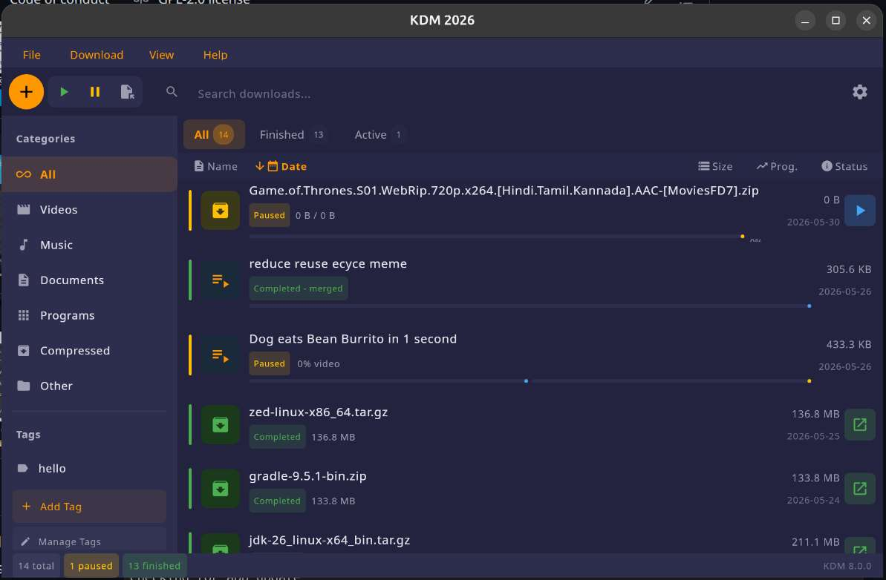
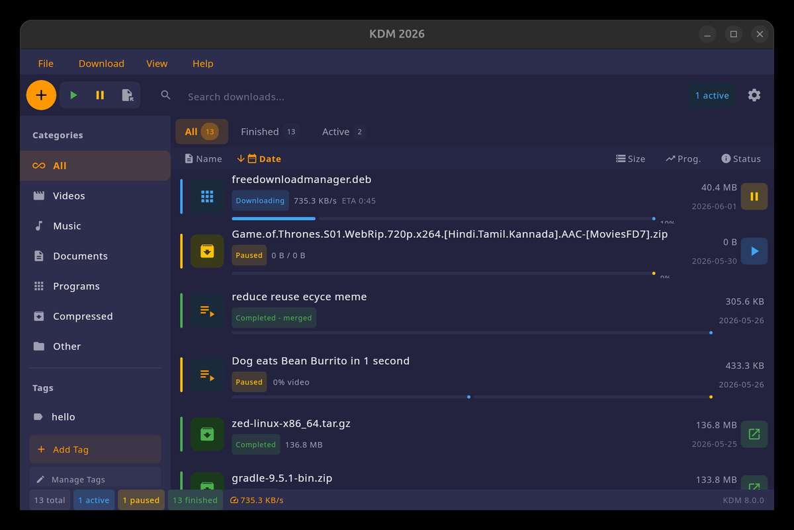
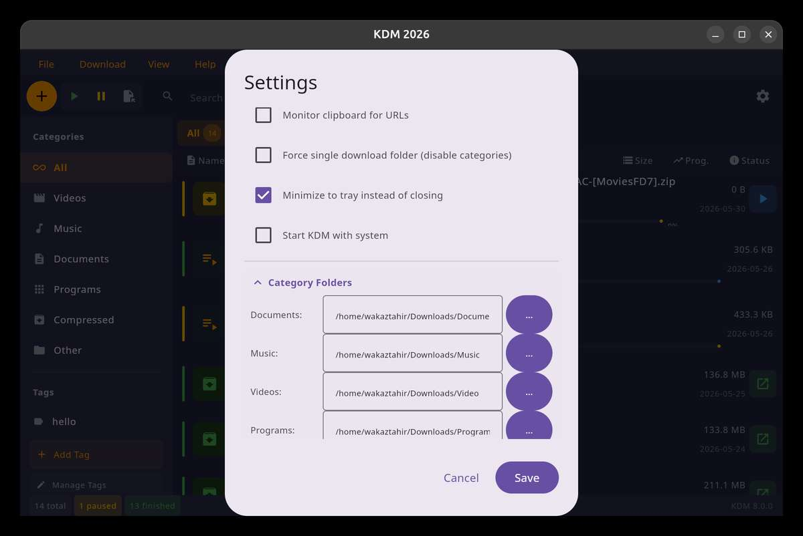
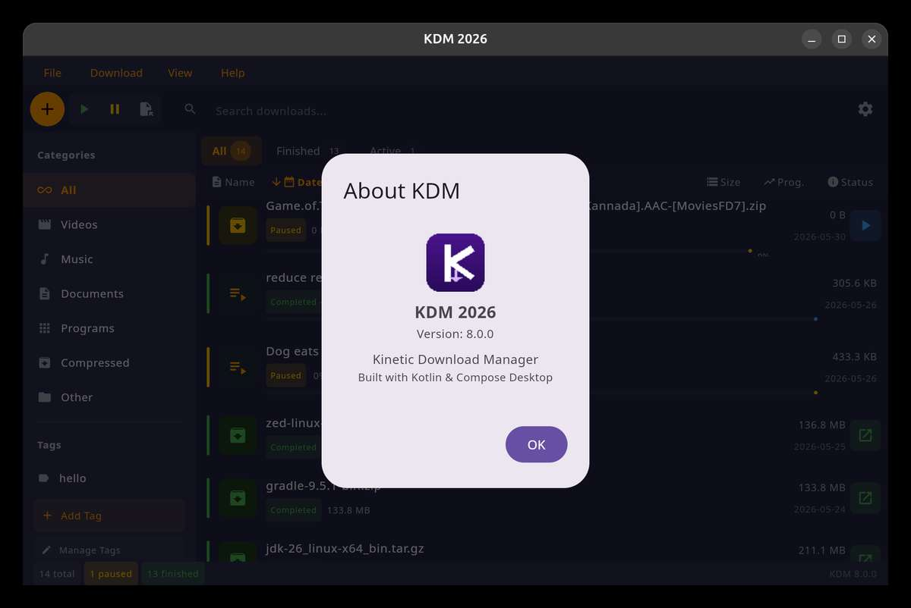
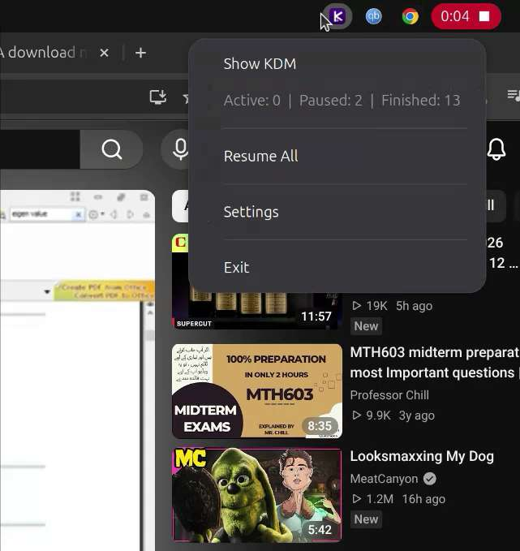
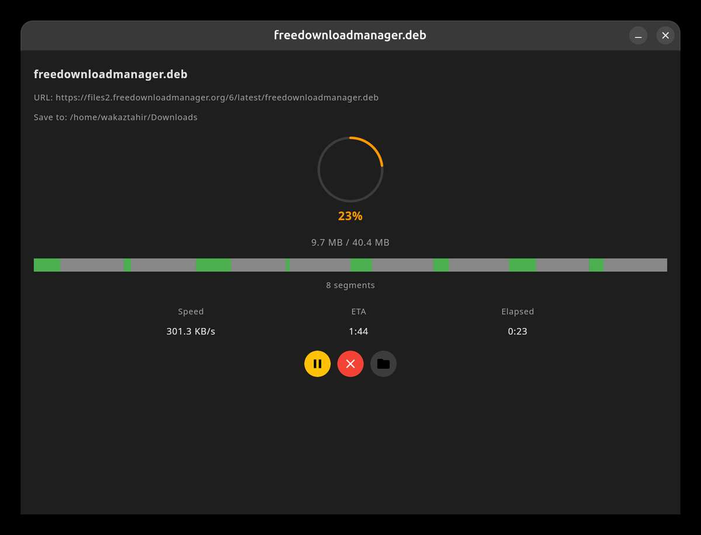
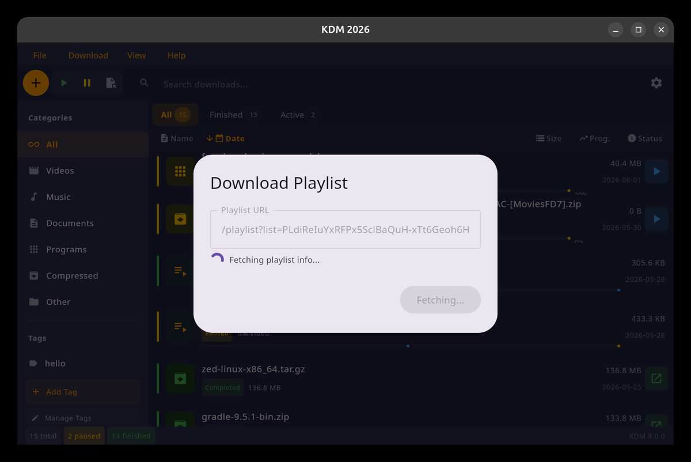
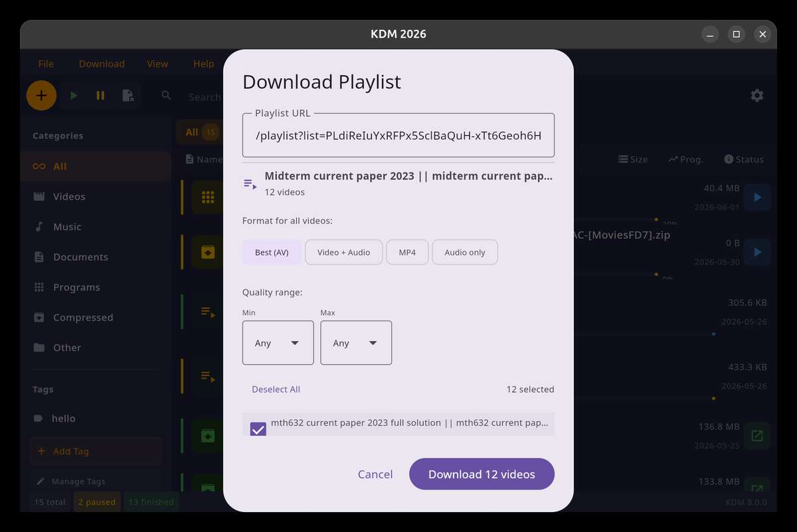

# Kinetic Download Manager

<p align="center">
  
</p>

<p align="center">
  <strong>Fast, modern, cross-platform download manager.</strong>
</p>

<p align="center">
  <a href="https://github.com/wiqis/kdm/actions/workflows/release.yml">
    
  </a>
  <a href="https://github.com/wiqis/kdm/releases">
    
  </a>
  <a href="https://github.com/wiqis/kdm/releases/latest">
    
  </a>
  <a href="LICENSE">
    
  </a>
</p>

KDM is a modern open-source download manager forked from XDM. Built with **Kotlin** and **Jetpack Compose Desktop**, it delivers a native-feeling experience across Windows, Linux, and macOS with a clean, modern UI.

---

## Features

- **High-speed downloads** — multi-segment downloading accelerates files by up to 500%
- **YouTube & playlist downloader** — paste a link, download videos or entire playlists; automatic yt-dlp setup included
- **Browser integration** — monitors Chrome, Firefox, Edge, and other browsers for download links
- **Resume broken downloads** — pick up where you left off after network interruptions
- **Video conversion** — built-in converter supports MP3, MP4, and 100+ device presets
- **Download scheduler** — queue and schedule downloads at your convenience
- **Proxy & authentication** — works with HTTP/HTTPS proxies, cookies, and redirects
- **System tray** — minimizes to tray with native OS menu for quick access
- **Dark mode** — full dark theme support

---

## Screenshots

<p align="center">
  
  
</p>
<p align="center">
  
  
</p>
<p align="center">
  
  
</p>
<p align="center">
  
  
</p>

---

## Downloads

| Platform | Format | Download |
|----------|--------|----------|
| Windows | `.msi` | [Latest release][releases] |
| Linux | `.deb` | [Latest release][releases] |
| macOS | `.dmg` | [Latest release][releases] |
| All | — | [All releases][releases] |

---

## Building from Source

### Prerequisites

- JDK 23 or higher
- Gradle 9.x (bundled wrapper)

### Commands

```bash
# Clone
git clone https://github.com/wiqis/kdm.git
cd kdm

# Build (compile + test)
./build.sh build

# Run tests
./build.sh test

# Package native installers
./build.sh package
```

Installers are written to `app/build/compose/binaries/`.

### IDE Setup

Open the project in **IntelliJ IDEA** (recommended) — the Gradle wrapper will automatically resolve dependencies. Make sure the Kotlin and Compose plugins are up to date.

---

## Tech Stack

| Component | Technology |
|-----------|------------|
| Language | Kotlin 2.3.x |
| UI Framework | Jetpack Compose Desktop 1.11.x |
| Build System | Gradle 9.x |
| Video/Audio | yt-dlp + FFmpeg |
| Compression | LZMA (XZ) |
| Native Packaging | Compose Multiplatform |

---

## Contributing

Contributions are welcome! Please open an [issue][issues] or submit a pull request.

- **Translations**: Help localize KDM — see the [translation guide][trans]
- **Bug reports**: File issues on the [issue tracker][issues]
- **Feature requests**: Open a discussion or issue

---

## License

This project is licensed under the Apache License 2.0 — see the [LICENSE](LICENSE) file for details.

---

## Acknowledgements

KDM is a fork of [Xtreme Download Manager (XDM)](https://github.com/subhra74/xdm). We're grateful to the original author and all contributors who made this project possible.

[releases]: https://github.com/wiqis/kdm/releases/latest
[issues]: https://github.com/wiqis/kdm/issues
[trans]: https://github.com/wiqis/kdm/wiki/Submitting-translations-for-KDM
